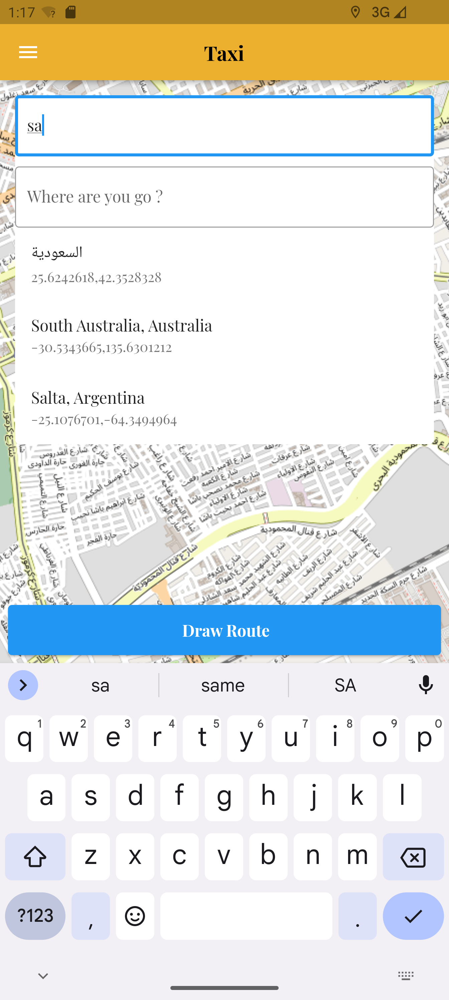
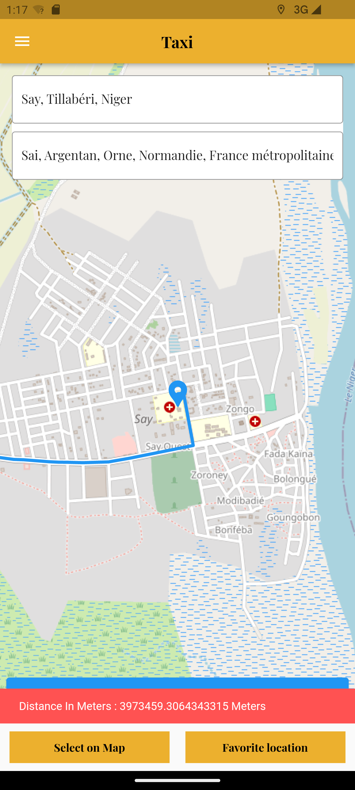

A flutter place search from two different location ,  location picker , make route between two points and measure distance(meters) between two point plugin that uses Open Street Map. it is completely free and easy to use.

## Features

Search location by places
Easy to use
make route between two points
measure distance(meters) between two point
change location

## Demo





## Getting started

import 'package:flutter_map_pick_route_sherifammar/flutter_map_pick_route_sherifammar.dart';

## Usage

you are required token from openrouteservice web site

```
 FlutterMapSearchAndPinkRoute(
          orsApiKey: "token from openrouteservice web site",
           latidedCurrent: 25, // require latitude
          longtideCurrent: 91, // require longitude
        )
 


